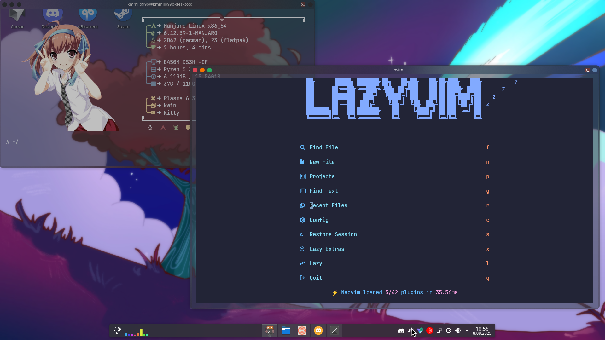

# My Dotfiles

These are my personal dotfiles for customizing my development environment. It includes configurations for Zsh, Kitty, Neofetch, Neovim, and Zed, tailored for a productive and aesthetically pleasing experience.

## Preview

Here's a glimpse of my setup:



## Configurations

This repository contains the following configurations:
<details>
    <summary><b>Zsh</b></summary>
- Description: Shell configuration (`.zshrc`) using Oh My Zsh with custom plugins (git, zsh-history-substring-search, zsh-navigation-tools, web-search, copypath, zsh-completions) and aliases. Includes a custom `fresh` command for Kitty terminal.
</details>

<details>
    <summary><b>Kitty</b></summary>
- Description: Terminal emulator settings (`.config/kitty/kitty.conf`) with the Nord theme, JetBrainsMono Nerd Font, custom keybindings, and UI enhancements. Additional themes are located in `.config/kitty/kitty-themes/themes/`.
</details>

<details>
    <summary><b>Neofetch</b></summary>
- Description: System information display configuration (`.config/neofetch/config.conf`) with custom info and colors. The image backend is set to Kitty, displaying a random image from the waifu directory.
</details>

<details>
    <summary><b>Neovim</b></summary>
- Description: Code editor configuration (`.config/nvim/`) using LazyVim with lazy.nvim, language server support (pyright, tsserver), Codeium, Copilot, yanky, gitsigns, and various UI enhancements. Includes treesitter parsers for multiple languages. (I don't have idea how to make to this one own dot file, so I use clean nvim)
</details>

<details>
    <summary><b>Zed</b></summary>
- Description: Code editor configuration (`.config/zed/`) with custom keybindings (`keymap.json`), settings (`settings.json`), and the Tokyo Midnight theme (`themes/Tokyo Midnight.json`).
</details>

## Installation

To set up these dotfiles:

1.  Clone the repository:
    ```bash
    git clone https://github.com/kmmiio99o/My-dotfiles.git
    ```

2.  Backup existing configurations. (Not needed but preferred)

3.  Create symbolic links:
    ```bash
    ln -s ~/My-dotfiles/.zshrc ~/.zshrc
    ln -s ~/My-dotfiles/.config/kitty ~/.config/kitty
    ln -s ~/My-dotfiles/.config/neofetch ~/.config/neofetch
    ln -s ~/My-dotfiles/.config/nvim ~/.config/nvim
    ln -s ~/My-dotfiles/.config/zed ~/.config/zed
    ```

4.  Install dependencies (Zsh, Oh My Zsh, Kitty, Neofetch, Neovim, Zed, plugins, language servers).

5.  Restart the shell and applications. Or type in terminal:
    ```bash
    source ~/.zshrc
    ```

## Credits

- [Oh My Zsh](https://ohmyz.sh/)
- [Kitty](https://sw.kovidgoyal.net/kitty/)
- [Neofetch](https://github.com/dylanaraps/neofetch)
- [LazyVim](https://www.lazyvim.org/)
- [Zed](https://zed.dev/)
